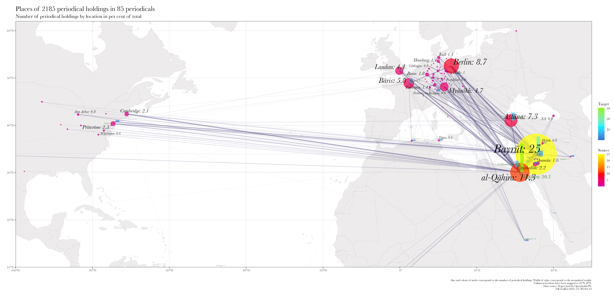

<!-- pre-process with pancritic -->
<!-- pre-process with pancritic -->
<!-- 
    $ cd /Users/Shared/BachUni/publications/github/p8fc0a1bd
    $ pancritic clio-globaler-süden.md -t markdown --critic-mode accept -o clio-globaler-süden_changes-accepted.md 
-->
<!-- beware that the wrapping brackets around pandoc citations must be removed from footnotes if they should not be wrapped in parentheses in the formatted output
    - Regex: \[([^\[]*?@.*?)\]
 -->

Die massenhafte Digitalisierung menschlichen Kulturerbes der letzten Jahrzehnte von Google Books bis Europeana verkörpert eine Kombination von Digitalisierung und World Wide Web, der ein großes und, soviel sei vorweg gesagt, uneingelöstes {--Heilsv--}{++ V++}ersprechen innewohnt: jede_r Mensch soll ohne Unterschied von Klasse, Religion, Geschlecht oder Herkunft uneingeschränkten Zugang zum Wissen der Welt und dem als gemeinschaftlich verstandenen Weltkulturerbe haben [cf. @Crymble2021Technology, 44-69; @Zaagsma2022Politics].  
Ein solches pluralistisches, auf Teilhabe aller fokussiertes und damit genuin demokratisches und ermächtigendes Ideal, verweigert sich allerdings {--zum einen --}der Diskussion um die möglichen negativen Auswirkungen einer allgemeinen Zugänglichkeit. Die Fragen "[**wer**]{.StrongCustom custom-style="StrongCustom"} hat Zugang zu [**was**]{.StrongCustom custom-style="StrongCustom"}?", "in welcher Form?" und "welche [**Folgen**]{.StrongCustom custom-style="StrongCustom"} hat das für sie oder andere?" werden von uns häufig auf Diskussionen um Datenschutz und Copyright reduziert. Aber schon bei der Auseinandersetzung um den 3D-Scan der Büste der Nofretete wird deutlich, dass es im Kern {--auch--} um vielschichtige globale Machtverhältnisse, um sich im digitalen fortschreibende (neo)koloniale Sammlungspolitiken und Wissensordnungen, {--um postkoloniale Diskurse,--} um Deutungshoheiten und um das Recht historisch marginalisierter Menschen zu sprechen und gehört zu werden, kurz um das Recht auf die eigene Geschichte und Geschichten geht.  

Dieses {--Heilsv--}{++ V++}ersprechen verschleiert zum anderen die Abhängigkeit der je konkreten Zugänglichkeit von sozio-technischen Infrastrukturen. Diese Infrastrukturen verweben Wissensordnungen, Zeichensysteme, juristische Normen, soziale und kulturelle Praktiken, wirtschaftliche Interessen und technische System und sind damit historisch kontingent. Die Infrastrukturen unserer vernetzten Digitalität haben eine Entstehungs- und Wirkungsgeschichte und sie sind ein inhärenter Teil der kulturellen Hegemonie des Globalen Nordens, weswegen es uns leicht fällt diese Verwobenheit nicht bzw. als die "natürliche" Ordnung der Dinge wahrzunehmen. 
Ein simples Beispiel mag das illustrieren. Digitale Daten sind in ihrem Kern winzige, volatile elektrische Ladungen. Damit sie von Menschen überhaupt als sinnbehaftete Informationen wahrgenommen werden können, benötigen sie multiple Übersetzungsschichten. Für die Übersetzung binärer elektrischer Ladungen in lesbare Zeichen bedarf es Regeln für die Übersetzung von Sequenzen von Ladungen in {--Zeichen --}{++Symbole++} und die Übersetzung dieser {--Zeichen --}{++Symbole++} in für Menschen wahrnehmbare sensorische Reize z.B. als auf einem Trägermaterial geschriebener Text, gesprochener Laut oder ertastbares Relief. 
Scheinbar statischer Text auf einem Bildschirm wird mindestens 60 mal die Sekunde {--horizontale Zeile für horizontale Zeile--} neu gezeichnet{-- und zwar von links nach rechts und von oben nach unten --}{++-- dass dies in horizontalen Zeilen von links nach rechts und von oben nach geschieht ist kein Zufall und wird im Verlauf dieses Textes eine Rolle spielen++}. 
{--Dafür--}{++Doch zunächst++} benötigt {++diese Darstellung ++}{--es zum einen--} eine stabile Stromversorgung, eine Fülle an endlichen natürlichen Ressourcen und menschlicher Arbeitskraft zur Erzeugung und Verteilung des Stroms sowie zur Herstellung und Installation des Bildschirmes und der für den Betrieb notwendigen Hard- und Software, globale Lieferketten, sowie in Standards (und best practices) gegossene Wissensordnungen, damit all diese Bestandteile zueinander passen und miteinander interagieren können.

Überblick über den folgenden Text:

- Ich werde den Gegenstand vor dem Hintergrund vornehmlich des vornehmlich arabischen, textuellen Kulturerbes der Gesellschaften des östlichen Mittelmeerraumes vorstellen.
- Hintergrund ist meine eigene Expertise, auf deren Basis ich nur wenig zu anderen Regionen des Globalen Südens sagen kann
- Das Konzept des Globalen Südens wird kurz vorgestellt 

# Das Fundament für den Zugang: Strom, Internet und Alphabetisierung

Zugang zu Stromversorgung ist eines der [[*Sustainable Development Goals*]{.EmphasisCustom custom-style="EmphasisCustom"} ([SDG]{.Abbreviation custom-style="Abbreviation"})][sdg] der Vereinten Nationen, aber auch 2019, kurz vor Ausbruch der globalen Covid-19 Pandemie, hatten knapp 800 Millionen Menschen keinen Zugang zu Elektrizität. Fast alle davon lebten im Globalen Süden und die überwiegende Mehrheit im subsaharischen Afrika. Die Projektionen der IEA gehen davon aus, dass auch 2030 660 Millionen Menschen, darunter 33 Prozent der gesamten Bevölkerung Afrikas, ohne jeglichen Zugang zu Elektrizität sein werden. Wobei Zugang hier heißt, dass eine basale Versorgung mit 250--500 kWh pro Jahr und Haushalt gegeben ist{++. Dieses Budget reicht dafür eine einzelne 100 W Glühbirne 6,84 bis 13,69 Stunden pro Tag brennen zu lassen.++}{--, die mit vier Glühbirnen für vier Stunden pro Tag, drei Stunden Ventilator pro Tag und zwei Stunden Fernsehen pro Tag, ausgeschöpft sind--} [@2020SDG7Methodology]. {--Gebiete mit regelmäßigen Stromausfällen zum load balancing, wie z.B. der Libanon, werden in diesen Statistiken als zu vollumfänglich versorgt geführt   --}
Damit ist deutlich, dass allein aufgrund der mangelnden Stromversorgung große Teile der Bevölkerung im Globalen Süden von der Teilhabe an Digitalität prinzipiell ausgeschlossen sind [@RitchieEtAl2022Energy; @WorldEnergyOutlook2020, 213]. 

Batteriebetriebene Geräte helfen bei der Lastverteilung und haben generell einen geringeren Stromverbrauch als klassische Glühbirnen. So verbrauchen Smartphones als primärer Zugang zu vernetzten Dateninfrastrukturen im Globalen Süden {--einen relativ geringen Stromverbrauch von --}etwa 3,5 kWh pro Jahr{--, sind in der Anschaffung aber extrem teuer--}. Schon ein durchschnittlicher Laptop verbraucht aber bei vierstündigem täglichen Betrieb 84 kWh im  Jahr. @Fig:strom-baghdad illustriert die Situation mit dem Slogan "Du bist so schön, wie eine zusätzliche Stunde Strom", der Mitte der 2010er Jahre in arabischsprachigen Ländern weite Verbreitung fand.   

{--<blockquote class="twitter-tweet" data-partner="tweetdeck">
&quot;حبيبتي، انت جميلة، كساعة اضافية من الكهرباء&quot;  هذا غزل أحد المتظاهرين في ساحة التحرير اليوم. رائعة حقيقة! <a href="http://t.co/KI8sAkY719">pic.twitter.com/KI8sAkY719</a>
&mdash; aya mansour (\@aya_mansour_11_) <a href="https://twitter.com/aya_mansour_11_/status/627223846244847616?ref_src=twsrc%5Etfw">July 31, 2015</a></blockquote>--}

](assets/images/tweet_ 627223846244847616.png){#fig:strom-baghdad}

Universeller Zugang zu Informations- und Kommunikationstechnologien ([ICT]{.Abbreviation custom-style="Abbreviation"}) ist ein weiteres [SDG]{.Abbreviation custom-style="Abbreviation"}, aber auch 2023 nehmen 36,6 Prozent der Weltbevölkerung, oder 2,93 Milliarden Menschen, nicht an vernetzten Dateninfrastrukturen teil{-- [@Digital2023GlobalOverviewReport2023]--}. Dabei ist {--auch--} der Zugang zu Internetverbindungen global ebenso ungleich verteilt, wie die Stromversorgung. Das subsaharische Afrika und Südasien sind auch hier wieder Regionen, die mit einem Viertel bis zur Hälfte der Bevölkerung schlechter versorgt sind als alle anderen Weltregionen. Insgesamt leben gut 85 Prozent der Menschen ohne Internetzugang in Afrika und Süd-, Ost- und Südostasien [@Digital2023GlobalOverviewReport2023]. Dazu kommt, dass Internetverbindungen im Globalen Süden, langsamer, instabiler und teurer sind.

Schließlich ist Lesen zu können praktisch eine der Grundvoraussetzungen für den Zugang zu Digitalität{-- in unserem Beispiel--} und ein weiteres [SDG]{.Abbreviation custom-style="Abbreviation"}. Auch dabei sind Menschen in Afrika (mit Ausnahme des südlichen Afrika) und Südasien am schlechtesten gestellt. Die Alphabetisierungsrate liegt in diesen Regionen zwischen 49 und 66 Prozent bei Frauen und 67 bis 80 Prozent bei Männern [@Digital2023GlobalOverviewReport2023].

Alphabetisierung ist allerdings an je konkrete Sprachen und Schriften in einer grundsätzlich, wenn auch abnehmend, vielsprachigen Welt geknüpft. Technische Infrastrukturen hingegen basieren alle auf dem Paradigma der lateinischen Schrift und zu ihrer überwiegenden Mehrheit auf der englischen Sprache. Dass Bildschirme das Bild horizontale Zeile für horizontale Zeile aufbauen und zwar von links nach rechts und von oben nach unten ist eben kein Zufall{--, sondern folgt dem Paradigma lateinischer Schriften--}. Inhalte, Interfaces und Standards sind durch die Sprachen des Globalen Nordens dominiert, die bereits die kolonialen Verwaltungssprachen des Globalen Südens waren. Für den globalen Zugang zu Digitalität ist dieser [*linguistic imperialism*]{.EmphasisCustom custom-style="EmphasisCustom"} eine weitere Dimension der Unzugänglichkeit. Er {--verschleiert die kulturelle Gebundenheit und --}erfordert von den Menschen des Globalen Südens neben den eigenen Muttersprachen und ihren Schriftsystemen auch noch die lateinische Schrift und mindestens eine Hegemonialsprache zu erlernen [@Phillipson1997RealitiesAndMyths; @Fiormonte2021Taxation; @Mahony2018Culturala; @MahonyGao2018Linguistic]. {--(Siehe [@fig:translatio-interface; @fig:css; @fig:r] für Beispiele).--}

{++[@fig:translatio-interface; @fig:html] illustrieren zwei Aspekte dieses ++}[*linguistic imperialism*]{.EmphasisCustom custom-style="EmphasisCustom"}, die in den folgen Abschnitten diskutiert werden. [@Fig:html] demonstriert, dass [HTML]{.Abbreviation custom-style="Abbreviation"} ([*Hypertext Markup Language*]{.EmphasisCustom custom-style="EmphasisCustom"}) als die Grundlage aller Inhalte im [*World Wide Web*]{.EmphasisCustom custom-style="EmphasisCustom"} einerseits zwingend mit den 26 Buchstaben des englischen Alphabets geschrieben werden muss und anderseits mit Englischkenntnissen im Großen und Ganzen verständlich ist ohne die Dokumentation der Standards zu lesen. Für den Aufbau einer Webpräsenz ist also zumindest die lateinische Schrift unerlässlich [@HTMLLivingStandard2023]. Bis in die Mitte der 2000er Jahre hinein durften auch die Adressen von Webseiten ([URL]{.Abbreviation custom-style="Abbreviation"}, [*Unique Ressource Locator*]{.EmphasisCustom custom-style="EmphasisCustom"}) ausschließlich diese 26 lateinischen Buschstaben enthalten. 

[{++@fig:translatio-interface++}] zeigt die Weboberfläche eines Projektes zur Digitalisierung arabischer, persischer und osmanischer Periodika der Universität Bonn. Um diese nutzen zu können, müssen Nutzer_innen entweder Deutsch oder Englisch beherrschen um sich in den Steuerelementen und Rahmentexten der Webseite zurecht zu finden. Außerdem müssen sie Deutsch und eine für die deutsche Wissenschaft spezifische Umschrift des Arabischen in lateinische Buchstaben verstehen und eingeben können um über die Metadatensuche im Katalog die Digitalisate der hier dargestellten, ab 1909 von 
[احمد عارف زين]{.Arabic custom-style="Arabic"}
 in Sidon herausgegebenen Zeitschrift 
[العرفان]{.Arabic custom-style="Arabic"}
 finden zu können.

::: columns
:::: column

{#fig:css}

::::
:::: Column

{--{#fig:r}--}

::::
:::

: Englisches Interface (gelb), Arabisch in deutscher Umschrift (lila), Deutsch (grün).](assets/images/translatio_interface-languages_annotated.png){#fig:translatio-interface}

# Die repräsentative Macht monolingualer Infrastrukturen

## Sprachen und Schriften des Globalen Südens: Arabisch als Beispiel

Arabisch ist vielleicht das prominenteste Beispiel für eine sogenannte [*under-resourced language*]{.EmphasisCustom custom-style="EmphasisCustom"}, obwohl es eine der weltweit wichtigsten [*Sprachen*]{.EmphasisCustom custom-style="EmphasisCustom"} mit mehr als 420 Millionen Sprecher_innen und eine von nur sechs Arbeitssprachen der Vereinten Nationen ist. Gleichzeitig ist die arabische [*Schrift*]{.EmphasisCustom custom-style="EmphasisCustom"} nach Latein und Chinesisch die drittwichtigste Schrift der Welt und wird von einer Fülle an historischen und zeitgenössischen afrikanischen und asiatischen Sprachen, wie z.B. Persisch, Urdu, Pashto, Usbekisch, Uigurisch oder Osmanisch, verwendet. Diese Schrift wird horizontal von rechts nach links geschrieben ([RTL]{.Abbreviation custom-style="Abbreviation"}). Die meisten {++der 28++} Buchstaben werden in Schreibrichtung innerhalb von Worten verbunden. Mehrere Buchstaben teilen sich eine Grundform (arab. [rasm]{.Transcription custom-style="Transcription"}), die, abhängig von ihrer Position innerhalb des Strings, bis zu vier verschiedene Formen haben kann. Diakritische Zeichen ([iʿjām]{.Transcription custom-style="Transcription"}) in Form von Punkten über- oder unterhalb des [rasm]{.Transcription custom-style="Transcription"} ermöglichen ansonsten gleiche Grundformen zu unterscheiden ([@fig:zakham-ar; @fig:zakham-ar-rasm]). Je nach Schreibstil (das Arabische kennt sechs kanonische Schreibstile) oder Typefont bilden mehrere aufeinanderfolgende Formen Ligaturen ([@fig:zakham-ar]). Sowohl Ligaturen als auch einzelne Buchstaben sitzen nicht notwendig auf einer einzigen Grundlinie und die Grundlinien können aus der Horizontalen geneigt sein. Trotz der Vielzahl der Sprachen aus verschiedenen Sprachfamilien, gibt es nur wenige Ausnahmen dieser schriftspezifischen Schreibregeln ([*script grammar*]{.EmphasisCustom custom-style="EmphasisCustom"}). Wichtig ist, dass für die meisten Leser_innen die diakritischen Zeichen nicht unbedingt notwendig sind, wie mehrere Ansätze die Zensur zentralisierter Sozialer Medien in autoritären {--arabischen--} Regimen mit Rückgriff auf (eine Annäherung an) den [rasm]{.Transcription custom-style="Transcription"} zu umgehen {--in den letzten Jahren--} eindrucksvoll belegen. Außerdem ist ihr Gebrauch abhängig von sich wandelnden regionalen und kulturellen Präferenzen. So werden in einigen Regionen diakritische Zeichen bei einer Reihe von Buchstaben vor allem am Ende des Wortes konsequent weggelassen.[^fn1]

::: columns
:::: column

{#fig:zakham-ar}

::::
:::: column

![Pseudo-[rasm]{.Transcription custom-style="Transcription"} des Textes in @fig:zakham-ar. Mit @Pohl2022Rasmifize erzeugt.](assets/images/arabic_rasm.png){#fig:zakham-ar-rasm}

::::
:::

## Zeichenkodierung und Darstellung

Computer sind Teil der kulturellen Traditionslinien des Globalen Nordens von Gutenbergs Druckerpresse über Telegraph und Schreibmaschinen zu Lochkarten und Satzmaschinen. Die mechanische und später elektronische Erfassung komplexer Schriftsysteme mit wesentlich größeren Zeichensätzen und anderen Schreibrichtungen als das Lateinische wurde hier weder als ausreichend wichtig noch als genügend profitabel betrachtet, um sie von Anfang an in die Designprozesse um Hardware und Standards mit einzubeziehen [@Nemeth2018ArabicHotMetal; @Singh+2018+TheMachineIn; @Mullaney2017ChineseTypewriter]. Dazu kommt, dass sich in der Folge der Nationsbildungsprozesse des langen neunzehnten Jahrhunderts mit ihrer Betonung von Nationalsprachen eine konzeptuell unzureichende Unterscheidung von Sprachen, Schriften und Eingabesystemen auch für Computer durchgesetzt hat. 

Damit Computer Buchstaben aufzeichnen können, müssen diese mit Hilfe von Zeichkodierungen in binäre elektrische Ladungen übersetzt werden. Damit diese Informationen ausgetauscht werden können, bedarf es Standards. Der vielleicht berühmteste und folgenreichste Standard für die elektronische Zeichenkodierung ist der [*American Standard Code for Information Interchange*]{.EmphasisCustom custom-style="EmphasisCustom"} ([ASCII]{.Abbreviation custom-style="Abbreviation"}) {++in der Version von 1967 mit der ++}[ASCII]{.Abbreviation custom-style="Abbreviation"} zu einem [ISO]{.Abbreviation custom-style="Abbreviation"} Standard wurde ([ISO 646]{.Abbreviation custom-style="Abbreviation"}). Dieser umfasst 95 druckbaren Zeichen: die Ziffern 0-9, die 26 Buchstaben des englischen Alphabets in Groß- und Kleinschreibung und 33 Satzzeichen und Symbolen. [ASCII]{.Abbreviation custom-style="Abbreviation"} ist eigentlich nur für das Englische geeignet -- schon Deutsch oder Französisch können nicht direkt abgebildet werden -- und neben allen anderen, herstellerspezifischen Zeichenkodierungen {--längst--} von Unicode mit einer Million Codepoints als dominanter Standard für die Zeichenkodierung seit den 2000ern abgelöst worden [@Wittern2013Character]. Aber [ASCII]{.Abbreviation custom-style="Abbreviation"} ist weiterhin ein häufiger kleinster gemeinsamer Nenner. So ist, zum Beispiel, der Anfang von 8-Bit Unicode, [UTF-8]{.Abbreviation custom-style="Abbreviation"}, für die 128 [ASCII]{.Abbreviation custom-style="Abbreviation"}-Zeichen reserviert und auch die aktuellste Fassung des [HTML]{.Abbreviation custom-style="Abbreviation"} Standards beschränkt Tag- und Attributnamen auf die 26 Buchstaben des englischen Alphabets in [ASCII]{.Abbreviation custom-style="Abbreviation"}-Kodierung [@HTMLLivingStandard2023, §13.1.2].{++ Das heisst aber auch, dass es für englische Texte und ihre Auszeichnung keinen Unterschied zwischen ASCII und Unicode gibt, womit die Einführung von Unicode keine Änderungen und Umgewöhnungen erforderte. ++}
 
Unicode hat {--Millionen von Codepoints und--} den von Herstellern unabhängigen Austausch und Interoperabilität von Texten auch in einer Vielzahl nicht-lateinischer Schriften, darunter {--auch--} seit Version 1.0.0 Arabisch, ermöglicht.[^cf1] Allerdings sind auch bei Unicode die zeitgenössischen Schriften des Globalen Nordens der Ausgangspunkt gewesen. Viele historische Schriften und zeitgenössische Schriften des Globalen Südens sind weiterhin nicht in Unicode (momentan in Version 15) erfasst[^cf2], während eine vollkommen neue Schrift digitaler Medialität, nämlich Emojis die treibende Kraft hinter der heute nahezu universalen Unterstützung von Unicode durch Betriebssysteme war.

Gleichzeitig ist Unicode ein, von einem in Kalifornien inkorporierten Herstellerkonsortium von Adobe, Airbnb, Amazon, Apple, Yat, Google, ETCO, Meta, Microsoft, Netflix, SAP und Salesforce, gepflegter{++ und in Englisch verfasster++} Standard und hat die lateinische Schriftgrammatik und das Paradigma des Drucks mit beweglichen Lettern universalisiert [c.f. @FiormonteEtAl2015PoliticsOfCode, 3-4]. Wenig überraschend unterstützt Unicode nicht das arabische System der Grundformen. Obwohl zwei der Prinzipien des Unicode Standards lauten, dass abstrakte Zeichen und nicht ihre graphische Form ([*characters, not glyphs*]{.EmphasisCustom custom-style="EmphasisCustom"}) erfasst werden und dass es innerhalb einer Schrift keine Duplikate geben solle ([*unification*]{.EmphasisCustom custom-style="EmphasisCustom"}) [@Unicode15, 15-18, 21-22], kommt es vor allem für nicht-westliche Zeichensysteme zu einer verwirrenden Kombination von Schriften und (National)Sprachen, die zu  mehreren Codepoints für das gleiche Zeichen führt (also quasi ein türkisches und ein deutsches "ü" als verschiedene Buchstaben).[^fn2] In der Folge muss sich jede_r, die arabische Schrift in einen Computer eingibt, sei es für eine Suche nach einer Quelle oder die Arbeit an einer digitalen Edition, für eine der möglichen Repräsentation entscheiden. Desweiteren muss sie entweder historische und geographische Varianten "normalisieren" oder visuell passende aber technisch falsche Glyphen verwenden. Die daraus folgende Vielfalt der Zeichenkodierungen für die gleiche Kette an arabischen Buchstaben hängt dann zudem maßgeblich von den Sprach- und Tastatureinstellungen des Betriebssystems ab [c.f. @VeisiEtAl2020KurdishLanguageProcessing].
So bevorzugen es beispielsweise Arabischschreibende in Ägypten die beiden Punkte unter dem finalen [yāʾ ]{.Transcription custom-style="Transcription"}(U+064A: [ي]{.Arabic custom-style="Arabic"}) am Ende eines Wortes wegzulassen. Um diese kulturelle Präferenz digital abzubilden, können entweder das Arabische [alif maqṣūra]{.Transcription custom-style="Transcription"} (U+0649: [ى]{.Arabic custom-style="Arabic"}) oder Persische [ye]{.Transcription custom-style="Transcription"} (U+06CC: [ی]{.Arabic custom-style="Arabic"}) gewählt werden [c.f. @TaghiZadehEtAl2017NewHybridStemming]. Leider unterstützen die meisten Suchalgorithmen moderner Betriebssysteme und darauf aufsetzende Anwendungssoftware diese Varianz nicht und führen ohne zusätzliche Anstrengungen zur Normalisierung oder Reduktion von Buchstaben auf den [rasm]{.Transcription custom-style="Transcription"} durch einzelne Entwickler_innen zu einer unbekannten Menge von [*false negative*]{.EmphasisCustom custom-style="EmphasisCustom"}s [@Milo.Martinez+2019+ANewStrategy]. Ein weiteres Beispiel sind die indo-arabischen Ziffern 0-9. Obwohl diese funktional gleich sind, beinhaltet Unicode mehrere volle Sätze von Codepoints für [*indische*]{.EmphasisCustom custom-style="EmphasisCustom"}, [*arabische*]{.EmphasisCustom custom-style="EmphasisCustom"} und [*europäische*]{.EmphasisCustom custom-style="EmphasisCustom"} Ziffern und bis vor wenigen Jahren hat die meiste Software ausschließlich letztere als Ziffern erkannt und verarbeitet, während erstere und ihre Subvarianten als Buchstaben behandelt wurden.

Doch Zeichenkodierung ist für die Mensch-Maschine Interaktion nicht ausreichend, die Codepoints müssen auch korrekt auf einer zweidimensionalen Fläche angezeigt werden. Damit sind wir bei einer weiteren Schicht der Unzugänglichkeit für das textuelle Erbe des Globalen Südens. Denn die korrekte Darstellung arabischer Schriften von rechts nach links, rechtsbündig und mit verbundenen Buchstaben ist weiterhin unzuverlässig und hängt von Betriebssystem und Software-Anwendungen ab. Beispiele für dieses Problem haben alle schon einmal gesehen, die in Deutschland im öffentlichen Personennahverkehr unterwegs waren und dort mit den wohlmeinenden Versuchen Werbetreibender konfrontiert waren: Arabische Schrift unverbunden und von links nach rechts (Der Umstand, dass solche Plakate gedruckt und aufgehängt werden, deutet darauf hin, dass keine_r der Verantwortlichen ein Lektorat in allen relevanten Sprachen für nötig erachtet).

::: columns
:::: column

<!-- Nicht verbunden und von rechts nach links -->

](assets/images/ErLBbWwVgAErjHy.jpg){#fig:arabic-fail-covid}

::::
:::: column

<!-- Korrektur -->

](assets/images/ErO3qtUVkAEUAQ_.jpg){#fig:arabic-fail-covid-corrected}

::::
:::

Das gilt auch für das [*World Wide Web*]{.EmphasisCustom custom-style="EmphasisCustom"}. [HTML5]{.Abbreviation custom-style="Abbreviation"} ([*Hypertext Markup Language*]{.EmphasisCustom custom-style="EmphasisCustom"}) ist der aktuelle Standard für die Strukturierung und Präsentation von Inhalten im World Wide Web [@HTMLLivingStandard2023]. {--Ab der Mitte der 2000er Jahre entwickelt, wird--} [HTML5]{.Abbreviation custom-style="Abbreviation"}{++ wird++} {--heute--} als ein "lebender Standard" von der [*Web Hypertext Application Technology Working Group*]{.EmphasisCustom custom-style="EmphasisCustom"} ([WHATWG]{.Abbreviation custom-style="Abbreviation"}) unterhalten, einem weiteren Industriekonsortium, dessen Mitglieder die führenden Hersteller von Webbrowsern, darunter Apple, Google, Microsoft und Mozilla, sind und, bis auf Mozilla, bereits ja auch Teil des Unicode-Konsortiums sind. [HTML5]{.Abbreviation custom-style="Abbreviation"} hat, inspiriert durch den älteren [*Extensible Markup Language*]{.EmphasisCustom custom-style="EmphasisCustom"} ([XML]{.Abbreviation custom-style="Abbreviation"}) Standard, ein globales `@lang` Attribute eingeführt. Damit lassen sich die Sprachen von Inhalten explizit und eindeutig in Form von [BCP 47]{.Abbreviation custom-style="Abbreviation"} Sprachtags, wie z.B. "de" für deutsch oder "ar-Arab-EG" für arabisch in arabischer Schrift mit den für Ägypten üblichen Präferenzen, festlegen [@BCP47; für eine Kritik dieses Standards die Auszeichnung von Transliterationen ostasiatischer Schriften siehe @Arnold2022MultilingualResearchProjects]. Die Darstellung von Inhalten in [HTML5]{.Abbreviation custom-style="Abbreviation"} wird mit [*Cascading Style Sheets*]{.EmphasisCustom custom-style="EmphasisCustom"} ([CSS]{.Abbreviation custom-style="Abbreviation"}) festgelegt.  Doch obwohl {--dieser Standard --}[HTML5]{.Abbreviation custom-style="Abbreviation"} bereits vor fünfzehn Jahren veröffentlicht wurde und weiterhin von einem Industriekonsortium entwickelt wird, nutzt keiner der führenden Webbrowser `@lang` für die Wahl eines korrekten Schriftsatzes oder die Entscheidung über die Links- oder Rechtsbündigkeit eines Textes in seinem mitgelieferten [CSS]{.Abbreviation custom-style="Abbreviation"}. Auch hier setzen lateinische Schriften die Norm. Selbst wenn eine Webseite den Inhalt als arabisch deklariert, wird dieser fälschlich als links-bündig angezeigt. Die notwendige Korrektur erfordert nur eine (sehr) kurze Zeile Code (`*[lang="ar"] {direction:rtl;}`) -- und zwar von jede_r, die Texte in rechts-nach-links Schriften online publizieren will. Auch ist das Problem nicht ausschließlich ästhetischer Natur. Satzzeichen am Ende der Zeile rutschen ohne diese Korrektur an den Anfang (Siehe die letzte Zeile in [@fig:zakham-ar-failure]).

![Fehlerhafte Darstellung von @oclc_4770057679-i_13-div_8.d1e1249 in modernen Webbrowsern mit dem mitgelieferten [CSS]{.Abbreviation custom-style="Abbreviation"}. Die Testdatei steht unter <https://doi.org/10.5281/zenodo.7781543> zur Verfügung.](assets/images/arabic_failure-browser.png){#fig:zakham-ar-failure}

Die eingeschränkte Unterstützung ist nicht auf den Konsum von Inhalten beschränkt. Digitale wissenschaftliche Editionen ([DSE]{.Abbreviation custom-style="Abbreviation"} von [*Digital Scholarly Edition*]{.EmphasisCustom custom-style="EmphasisCustom"}) werden den auch von der [DFG]{.Abbreviation custom-style="Abbreviation"} vorgeschriebenen [*best practices*]{.EmphasisCustom custom-style="EmphasisCustom"} entsprechend in [XML]{.Abbreviation custom-style="Abbreviation"} ausgezeichnet und folgen dabei den Richtlinien der [[*Text Encoding Initiative*]{.EmphasisCustom custom-style="EmphasisCustom"} ([TEI]{.Abbreviation custom-style="Abbreviation"}{--/XML--})][tei] [@TEIP5Guidelines400; @DfgPraxisregelnDigitalisierung+2016; @AltenhonerEtAl2023DFGPraxisregeln]. Dabei können die Auszeichnungen schnell so umfangreich werden, dass es für die leichtere Handhabung durch menschliche Bearbeiter_innen besser ist, diese zu verbergen und die Ansicht eines Dokuments mit [CSS]{.Abbreviation custom-style="Abbreviation"} zu gestalten. Allerdings verhält sich Software für die Bearbeitung von digitalen Editionen nicht anders als Webbrowser. Zwar haben die Entwickler des populären oXygen [XML]{.Abbreviation custom-style="Abbreviation"} Editors die notwendigen Zeilen auf unseren Vorschlag hin 2015 zu ihrem [CSS]{.Abbreviation custom-style="Abbreviation"} hinzugefügt, aber diese Unterstützung ist auf das Arabische und einige wenige andere rechtsläufige Schriften sowie [TEI/XML]{.Abbreviation custom-style="Abbreviation"} beschränkt.

Dies führt uns schließlich zu einer weiteren Dimension der unzureichenden Unterstützung für {--das Arabische--}{++ die Schriften des Globalen Südens++} in der Digitalität: die Darstellung von bi- oder multidirektionalem Text auf einer zweidimensionalen Fläche und, im Besonderen, auf der gleichen Zeile. Wenn sich die Direktionalität von Schriftsystemen in einer der Dimensionen unterscheidet, also z.B. Linksläufiges Englisch mit rechtsläufigem Hebräisch gemischt wird, dann ist es basierend auf der Schriftform unmöglich zu entscheiden, ob alle Schriften die gleiche Wichtigkeit innerhalb des vorliegenden Textes haben oder welche der Schriften Vorrang vor den anderen hat -- die logische Zeichenfolge anderseits ist eindeutig, da sie nur eine Dimension kennt. Algorithmen und Standards lösen das Problem auf eine von zwei Arten: sie betrachten Latein als das implizite Paradigma oder sie entscheiden auf der Basis des ersten Buchstabens welche Schrift die Hauptschrift eines Textes ist. So ist z.B. [XML]{.Abbreviation custom-style="Abbreviation"} vollständig Unicode-konform, was heißt, dass auch die Namen und Werte sämtlicher Auszeichnungselemente und -attribute in jedem von Unicode unterstütztem Schriftsystem geschrieben werden können (in der Praxis findet das aufgrund der Dominanz des Englischen und mangelnder Ressourcen so gut wie nicht statt). Die Einzige Ausnahme ist die [XML]{.Abbreviation custom-style="Abbreviation"} Deklaration am Anfang einer Datei (`<?xml version="1.0" encoding="UTF-8"?>`), die festlegt, dass es sich um eine XML Datei handelt. Als weitreichende Konsequenz legt der Unicode [*bidi-Algorithmus*]{.EmphasisCustom custom-style="EmphasisCustom"} (von [*bidirectional*]{.EmphasisCustom custom-style="EmphasisCustom"}) links-nach-rechts als die Basisrichtung fest, wodurch z.B. die oben erwähnten Satzzeichen an das falsche Ende von rechtsläufigen Zeichenketten wandern ([@fig:bidi-xml-oxygen, Zeilen 37, 38]) [@W3CUnicodeBiDiBasics; @ICUDocumentationBiDi].

![Example of bidirectional [XML]{.Abbreviation custom-style="Abbreviation"} {--from the beginning--} of [@oclc_1034545644-i_15-div_1.d2e634]. The colored arrows indicate reading direction. The reading order is indicated by the numbers below the arrows](/Users/Shared/BachUni/publications/github/pae326271/assets/images/xml_zuhur-v_2-i_4_annotated.png){#fig:bidi-xml-oxygen}

Logographische und Silbenschriften, wie z.B. das Chinesische, Koreanische oder Japanische, bei denen die Zeichen nicht miteinander verbunden sind, erlauben sämtliche Schreibrichtungen. In Ostasien wurden diese Schriften historisch in vertikalen Spalten von oben nach unten und von rechts nach links geschrieben. Die heute übliche, an das Lateinische angepasste Praxis ist eine direkte Folge unzureichender technischer Systeme und des ihnen eingeschriebenen [*linguistic imperialism*]{.EmphasisCustom custom-style="EmphasisCustom"} des Globalen Nordens [@Obana1997VerticalHorizontalReading]. 

## Transliteration

Jenseits der grundsätzlichen Unmöglichkeit geschriebenes Arabisch mit den vorhandenen Technologien in digitaler Form adäquat aufzuzeichnen, erfordern der kulturelle Record und Praktiken des Globalen Südens konstante Übersetzung{--en--} und {--Transkriptionen --}{++Transliteration++}, die selbst wiederum mit den sozio-technischen Traditionen des Globalen Nordens verwoben sind. So ist die klassische Lösung von Wissenschaft ebenso wie Kolonialverwaltungen für das Problem nichtlateinische Schriften mit den vorhandenen technischen Apparaten wie Schreib- oder Satzmaschinen für lateinische Schrift erfassen zu müssen, die Umschrift in lateinische Buchstaben ([@fig:zakham-ijmes]).[^cf3] Hierbei wird zwischen der [*Transkription*]{.EmphasisCustom custom-style="EmphasisCustom"} (lautgerechter Wiedergabe) und der [*Transliteration*]{.EmphasisCustom custom-style="EmphasisCustom"} (buchstabengetreuer Wiedergabe des Schriftbildes) unterschieden. In der Praxis werden allerdings beide Ansätze {--auch--} miteinander kombiniert. Umschriften für die gleiche Kombination von Ausgangs- und Ziel-Schriften und Sprachen sind von Entstehungskontext zu Entstehungskontext verschieden und unterliegen wie alle sozialen Praktiken einem historischen Wandel. 
Der Titel der von Bulus Šahade von 1919 bis 1938 in Jerusalem herausgegebene Wochenzeitung [Mirʾāt aš-Šarq]{.Transcription custom-style="Transcription"} soll das am Beispiel des Arabischen illustrieren. "[Mirʾāt aš-Šarq]{.Transcription custom-style="Transcription"}" ist die den Regeln der [*Deutsche Morgenländische Gesellschaft*]{.EmphasisCustom custom-style="EmphasisCustom"} ([DMG]{.Abbreviation custom-style="Abbreviation"}) folgende Umschrift des arabischen Titels 
[مرآة الشرق]{.Arabic custom-style="Arabic"}
in lateinische Schrift, die zum einen 1:1 Entsprechungen für Buchstaben vorschreibt, zum anderen aber um eine phonetische Wiedergabe bemüht ist.[^cf4] Die international gebräuchlichere Umschrift dieses Titels nach den Regeln des (amerikanischen) [*International Journal of Middle East Studies*]{.EmphasisCustom custom-style="EmphasisCustom"} ([IJMES]{.Abbreviation custom-style="Abbreviation"}) ist "[Mirʾāt al-Sharq]{.Transcription custom-style="Transcription"}" [@IJMESTransliterationSystem; @ALALC2012Arabic]. Schließlich hat die Zeitschrift, da sie im britischen Mandatsgebiet Palästina erschien, ihren Titel im Seitenkopf selbst in lateinische Schrift als "[Meraat al-Sherk]{.Transcription custom-style="Transcription"}" angegeben [@EAP119/1/24_website].
Zu dieser Abhängigkeit der Umschrift von der Zielsprache kommt noch hinzu, dass sich die Umschrift bei {--gleichem Alphabet--}{++ gleicher Ausgangs++}[*schrift*]{.EmphasisCustom custom-style="EmphasisCustom"} und gleicher Zielsprache je nach Ausgangs[*sprache*]{.EmphasisCustom custom-style="EmphasisCustom"} unterscheidet. So haben die Katalogisierer_innen des [*Endangered Archives Programme*]{.EmphasisCustom custom-style="EmphasisCustom"} ([EAP]{.Abbreviation custom-style="Abbreviation"}) der British Library den Osmanischen Titel
[يكي تصوير افكار]{.Arabic custom-style="Arabic"}
 fälschlicherweise als 
[تصوير افكار]{.Arabic custom-style="Arabic"}
 gelesen, angenommen, dass es sich hierbei um Arabisch handelt und dementsprechend "korrekt" als [Taṣwīr Afkār]{.Transcription custom-style="Transcription"} transkribiert, während die richtige [IJMES]{.Abbreviation custom-style="Abbreviation"} Transkription des Osmanischen [Yeni]{.Transcription custom-style="Transcription"} [Taṣvīr-i Efkār]{.Transcription custom-style="Transcription"} gewesen wäre [@EAP119/1/18_website].

Schließlich muss erwähnt werden, dass alle diese wissenschaftlichen Umschriften diakritische Zeichen benötigen. Diese können zwar seit der Einführung von Unicode standardmäßig erfasst werden, müssen aber von der je benutzen Software und Fonts unterstützt werden und benötigen ein gewisses technisches Wissen für die Eingabe. Um die technischen Probleme zu umgehen und Software nutzen zu können, die nichtlateinische Schriften oder Unicode nicht vollumfänglich unterstützt, existieren mehrere Systeme für die 1:1 Transliteration des Arabischen, die die automatische und verlustfreie bidirektionale Umwandlung ermöglichen. Das wichtigste und in den Digital Humanities gebräuchlichste System ist die [*Buckwalter*]{.EmphasisCustom custom-style="EmphasisCustom"} Transliteration, da sie mit reinem [ASCII]{.Abbreviation custom-style="Abbreviation"} auskommt [@Habash+2010+IntroductionToArabic, 20, 25-26; @Buckwalter2004ArabicMorphological]. Wie aus der Umschrift "[mrMp Alcrq]{.Transcription custom-style="Transcription"}" für die obige Zeitschrift [Mirʾāt aš-Šarq]{.Transcription custom-style="Transcription"} deutlich wird, haben diese Systeme allerdings einen großen Nachteil: sie sind für Menschen nicht intuitiv lesbar und damit eine weitere Zugangsbarriere. Andere (historische) technische Transkriptionssysteme umgehen dieses Problem indem sie die diakritischen Zeichen der wissenschaftlichen Umschriften durch in [ASCII]{.Abbreviation custom-style="Abbreviation"} vorhandene Symbole ersetzen und [Mirʾāt aš-Šarq]{.Transcription custom-style="Transcription"} z.B. als "[mir'_a=t al-^sarq]{.Transcription custom-style="Transcription"}" transkribieren [vgl. @Romanov2021ArabicBetaCode].

 

![Transliteration des Textes in @fig:zakham-ar nach dem [IJMES]{.Abbreviation custom-style="Abbreviation"} System](assets/images/arabic_ijmes.png){#fig:zakham-ijmes}

## Systeme der Wissensorganisation: Bibliothekskataloge und Findmittel

Warum ist eine so ausführliche Diskussion von Zeichenkodierungen, Bidi-Algorithmen und Umschriften hier relevant? Weil technische Systeme zur Wissensorganisation, wie Bibliothekskataloge, Normdateien, Zensi, Kataster etc. etc. ebenso wie wissenschaftliche Sekundärliteratur historische Dokumente sind, die auf sich wandelnden technischen Systemen aufsetzen, auf den unterschiedlichsten, sich ebenfalls wandelnden, ([*best*]{.EmphasisCustom custom-style="EmphasisCustom"}) [*practices*]{.EmphasisCustom custom-style="EmphasisCustom"} basieren und von Menschen umgesetzt werden, die Fehler machen, teilweise die Sprachen vor ihnen nicht lesen können und, mit den uns bekannten technischen Beschränkungen konfrontiert, Wege suchen das von ihnen gesehene so exakt wie möglich abbilden zu können. 
Die beste, wenn auch wegen der hohen Kosten unrealistischste Lösung wäre es sämtliche Artefakte in nichtlateinischen Schriften erneut vom Original und in den Originalschriften zu katalogisieren [vgl. @Weinberg1974Transliteration]. Umschriften sollten offensichtlich sein oder explizit markiert werden und korrekt und konsequent angewandt werden. Bis dahin sind wir allerdings mit den Spolien einer technischen Evolution von handschriftlichen Listen über maschinengeschriebenen Karteikarten zu Mikrofilmen, digitalen Faksimiles (Scans), Texterkennungsalgorithmen und Datenbanken konfrontiert. 

Bibliographische Discoverysysteme sind durchweg nicht darauf ausgelegt die Vielzahl an Schreibweisen in mehreren Schriften mit und ohne diakritische Zeichen als äquivalent zu betrachten, wenn die Normierung nicht bereits in den Datensätzen explizit vorgenommen wurde. Außerdem hinken die Suchinterfaces für Nutzer_innen, den Erfassungsmöglichkeiten für Katalogisierer_innen im Allgemeinen hinterher. Dies ist umso gravierender, als dass sich seit den 2000ern das Google-Paradigma eines einzelnen Suchschlitzes für schlagwortbasierte Anfragen anstelle komplexerer Schnittstellen, wie z.B. [*Facetted browsing*]{.EmphasisCustom custom-style="EmphasisCustom"}, durchgesetzt hat.[^cf5] Die je konkreten Eigentümlichkeiten von Suchfunktionen werden allerdings nur selten transparent dokumentiert und den Nutzer_innen kommuniziert. Jede_r muss durch Versuch und Irrtum herausbekommen ob in nichtlateinischen Schriften gesucht werden kann; ob und in welchem Umfang die mögliche Vielzahl der Zeichenkodierung für die gleichen Grapheme normalisiert wird; ob und in welchem Umfang lateinische Umschriften normalisiert werden; ob und in welchem Umfang diakritische Zeichen aus der lateinischen Umschrift entfernt werden; ob und in welchem Umfang Morphologisierer und Lemmatisierer benutzt werden; usw. usf.

So sind in der [Zeitschriftendatenbank][zdb] ([ZDB]{.Abbreviation custom-style="Abbreviation"}) 231 vor 1930 erschienene "arabische" Periodikatitel in Bibliotheken in Deutschland und Österreich nachgewiesen.  Diese Zahl umfasst einige Dubletten und eine Reihe von Titeln in arabischer Schrift aber nicht in arabischer Sprache. Dank Unicode lässt sich die [ZDB]{.Abbreviation custom-style="Abbreviation"} über die Suchmaske auf der Webseite auch {--nach Titeln --}in arabischer Schrift durchsuchen, allerdings ist diese in den der [ZDB]{.Abbreviation custom-style="Abbreviation"} zugrunde liegenden Katalogen nur in sehr geringem Umfang erfasst. Die notwendigen Umschriften folgen im Prinzip den Regeln der [DMG]{.Abbreviation custom-style="Abbreviation"} und werden von der [ZDB]{.Abbreviation custom-style="Abbreviation"} korrekt angezeigt. Der Suchalgorithmus vereinfacht die Umschrift, indem z.B. Buchstaben mit diakritischen Zeichen auf ihre Grundform reduziert werden ("[ǧ]{.Transcription custom-style="Transcription"}" wird mit "[g]{.Transcription custom-style="Transcription"}" gefunden). {--Außerdem wird d--}{++D++}er präfigierte arabische Artikel "[al-]{.Transcription custom-style="Transcription"}" {++wird++} teils als Bestandteil von Nomen, teils als eigenständiges Wort behandelt, obwohl dies serverseitig einfach zu normalisieren wäre. In der Folge lässt sich die zwischen 1870 und 1885 in Beirut erschienene Zeitung [al-Ǧanna]{.Transcription custom-style="Transcription"} weder in arabischer Schrift (
[الجنة]{.Arabic custom-style="Arabic"}
) noch in der international gebräuchlichen Umschrift als "[al-Janna]{.Transcription custom-style="Transcription"}", aber auch nicht mit "[al-Ǧanna]{.Transcription custom-style="Transcription"}", sondern nur mit "[Ǧanna]{.Transcription custom-style="Transcription"}" finden ([@fig:zdb-ar; @fig:zdb-dmg; @fig:zdb-dmg-defective]). [Mirʾāt aš-Šarq]{.Transcription custom-style="Transcription"} wird mit "[Mirʾat as-sarq]{.Transcription custom-style="Transcription"}" {--oder "Mirʾa* sarq"--} gefunden, aber solange mensch nicht entdeckt, dass die [ZDB]{.Abbreviation custom-style="Abbreviation"} sogenannte Wildcards unterstützt, bei denen ein (!) Buchstabe durch "`*`" ersetzt wird, also "`Mir*a* sarq`", muss der Suchstring "`ʾ`" für das arabische [hamza]{.Transcription custom-style="Transcription"} enthalten -- ein diakritisches Zeichen, dass sich auf keiner Standardtastaturbelegung finden lässt. Eine Bildschirmtastatur bietet die [ZDB]{.Abbreviation custom-style="Abbreviation"} nicht an. Solche browserbasierten Bildschirmtastaturen, bei denen Glyphen mit der Maus ausgesucht werden können, finden sich zum Beispiel unter <https://www.lexilogos.com/keyboard/>.
Die Katalogsuche der besitzenden Bibliotheken, der [Staatsbibliothek zu Berlin][stabikat] und der [Freien Universität Berlin][fulib], sind hier einfacher zu benutzen, da sie scheinbar {--sämtliche nicht in ASCII enthaltenen Zeichen aus dem Suchstring entfernt--}{++ den Suchstring auf in ++}[ASCII]{.Abbreviation custom-style="Abbreviation"}{++ enthaltene Buchstaben reduzieren++} und damit [Mirʾāt aš-Šarq]{.Transcription custom-style="Transcription"} auch mit "[Mir'at sarq]{.Transcription custom-style="Transcription"}" und sogar "[Mirat Sarq]{.Transcription custom-style="Transcription"}" finden. Keiner der deutsche Kataloge findet die Zeitschrift aber in der international gebräuchlichen Umschrift [Sharq]{.Transcription custom-style="Transcription"} für [Šarq]{.Transcription custom-style="Transcription"}.

Französische Kataloge, wie der [[*Catalogue collectif de France*]{.EmphasisCustom custom-style="EmphasisCustom"} ([CCFR]{.Abbreviation custom-style="Abbreviation"})][ccfr] oder der der [[*Bibliothèqe nationale de France*]{.EmphasisCustom custom-style="EmphasisCustom"} ([BnF]{.Abbreviation custom-style="Abbreviation"})][bnf] erfordern eine dem System der [DMG]{.Abbreviation custom-style="Abbreviation"} ähnliche Umschrift ([Mirʾāt al-Šarq]{.Transcription custom-style="Transcription"}), scheinen aber ebenfalls den Suchstring auf [ASCII]{.Abbreviation custom-style="Abbreviation"} Buchstaben durch Entfernen von diakritischen Zeichen und Sonderzeichen zu reduzieren. Auch hier sind defektive Anfragen nach "[Mirʾat Sarq]{.Transcription custom-style="Transcription"}" und "[Mirat Sarq]{.Transcription custom-style="Transcription"}" erfolgreich. Die [BnF]{.Abbreviation custom-style="Abbreviation"} hat auch einen großen Teil ihrer arabischen Bestände in Originalschrift erfasst, so dass direkt nach 
[مرآة الشرق]{.Arabic custom-style="Arabic"}
 gesucht werden kann. Der diese Daten aggregierende [CCFR]{.Abbreviation custom-style="Abbreviation"} unterstützt die Suche in arabischer Schrift nicht, hat aber Zugriff auf arabische Daten aus anderen Katalogen als dem der [BnF]{.Abbreviation custom-style="Abbreviation"}.
{--scheinbar keinen Zugriff auf diese Daten der BnF und kann --}Die meisten für die Umschrift benötigten Zeichen können vom [CCFR]{.Abbreviation custom-style="Abbreviation"} nicht angezeigt werden.

Auch englischsprachige Kataloge, wie der der [[*British Library*]{.EmphasisCustom custom-style="EmphasisCustom"}][bl] oder [OCLC]{.Abbreviation custom-style="Abbreviation"}s [[*Worldcat*]{.EmphasisCustom custom-style="EmphasisCustom"}][worldcat], erlauben Danke Unicode die Suche in arabischer Schrift und reduzieren Suchanfragen in lateinischer Schrift auf den [ASCII]{.Abbreviation custom-style="Abbreviation"} Zeichensatz. Hier muss also, dem [IJMES]{.Abbreviation custom-style="Abbreviation"}-System entsprechend, mindestens nach "[Mirat Sharq]{.Transcription custom-style="Transcription"}" gesucht werden. 

::: columns
:::: column

![Suche in der [ZDB]{.Abbreviation custom-style="Abbreviation"} nach der Zeitschrift [al-Ǧanna]{.Transcription custom-style="Transcription"} in arabischer Schrift](assets/images/zdb_janna-ar.png){#fig:zdb-ar}

::::
:::: column

![Suche in der [ZDB]{.Abbreviation custom-style="Abbreviation"} nach der Zeitschrift [al-Ǧanna]{.Transcription custom-style="Transcription"} in [DMG]{.Abbreviation custom-style="Abbreviation"} Umschrift ([al-Ǧanna]{.Transcription custom-style="Transcription"})](assets/images/zdb_janna-ar-Latn.png){#fig:zdb-dmg}

::::
:::: column

![Suche in der [ZDB]{.Abbreviation custom-style="Abbreviation"} nach der Zeitschrift [al-Ǧanna]{.Transcription custom-style="Transcription"} in [DMG]{.Abbreviation custom-style="Abbreviation"} Umschrift ohne diakritische Zeichen und den bestimmten Artikel ([Ganna]{.Transcription custom-style="Transcription"})](assets/images/zdb_janna-ar-Latn-no-al.png){#fig:zdb-dmg-defective}

::::
:::

# Digitalisierung

Nur Material, das gesammelt, katalogisiert und dann auch von Kurator_innen gefunden wird, kann überhaupt digitalisiert, d.h. als Bild oder Text in einem digitalen Format remedialisiert, werden. Für arabische Periodika stellt sich dieser Zusammenhang wir folgt dar. Nach zehnjähriger Forschung wissen wir von 3550 Titeln, die weltweit vor 1930 publiziert worden sind. Von diesen haben wir 775 oder 21,83% in Sammlungen lokalisieren können. Von diesen 775 sind wiederum 233 oder 6,56% aller Titel digitalisiert worden ([@fig:map-periodicals-status]) [@Mestyan.etal+2020+JaraidAchronology; @Mestyan.Grallert+2012+ProjectJaraid; @Mestyan.Grallert+2020+JaraIdChronology]. Eine Digitalisierungsquote von einem knappen Drittel der auffindbaren Titel erscheint zunächst überraschend hoch. Allerdings können wir momentan weder den Umfang der Sammlungen noch der Digitalisierung einzelner Publikationen beziffern. Es kann sein, dass nur eine von hunderten Ausgaben in einer Sammlung existiert oder digitalisiert wurde. Außerdem sollten für die Bewertung der Digitalisierungsrate im Vergleich zwischen Globalem Süden und Globalem Norden die absoluten Zahlen nicht aus dem Blick verloren werden. @Tbl:digitisation demonstriert das Missverhältnis beispielhaft.

Auffallend ist weiterhin, dass sich ein großer Teil der uns bekannten überlebenden Artefakte in den Kulturerbeinstitutionen des Globalen Nordens befindet und auch dort digitalisiert wurde ([@fig:map-periodicals-holdings]). Dabei wurden 66 oder 28,33% aller digitalisierter Titel von mehreren Institutionen digitalisiert; 21 davon sogar von drei oder mehr. Bei den hohen Kosten und geringen für die Digitalisierung dieser Materialien zur Verfügung stehenden Mitteln, ist eine Koordination dieser Anstrengungen überfällig .

![Verteilung von in Südwestasien und Nordafrika ([SWANA]{.Abbreviation custom-style="Abbreviation"}) zwischen 1789 und 1929 publizierten arabischen Periodikatiteln. Die Größe der Tortendiagramme korrespondiert mit der Anzahl der publizierten Titel. Die Größe der Tortenstücke zeigt die Anteile von in Sammlungen nachgewiesenen und von digitalisierten Titeln an](assets/images/map-data-set-periodicals_1789-1929-scatterpie-mena-label_en.png){#fig:map-periodicals-status}

{#fig:map-periodicals-holdings}

|                         | Arabische Periodika (1798--1918)         | [Der Erste Weltkrieg im Spiegel hessischer Regionalzeitungen](https://hwk1.hebis.de) |
| -------------           | -------------------------------  --      | ---------------------------------------------------------------------                |
| Gemeinschaft            | c. 420 Mio. Arabischsprechende           | c. 6.2 Mio. Einwohner_innen                                                          |
| Periodika               | 2054 Zeitungen und Zeitschriften         | 125 Zeitungen                                                                        |
| davon digitalisiert     | 156 Titel                                | 125 Titel mit mehr als 1.5 Mio. Seiten                                               |
| in Prozent              | 7,59                                     | 100                                                                                     |
| Art der Digitalisierung | fast ausschließlich Faksimiles           | Faksimiles und Volltext                                                              |
| Zugang                  | Bezahlschranken, Geo-fencing             | Open Access                                                                          |
| Interface               | vornehmlich ausschließlich Fremdsprachen | Quellen- und Fremdsprachen                                                             |

Table: Beispielhafter Vergleich digitalisierter Quellen zwischen dem Global Süden und Norden {#tbl:digitisation}

Als Nutzer_innen wünschen wir uns natürlich umfangreiche [*wissenschaftliche digitale Editionen*]{.EmphasisCustom custom-style="EmphasisCustom"} ([DSE]{.Abbreviation custom-style="Abbreviation"} von [*Digital Scholarly Editions*]{.EmphasisCustom custom-style="EmphasisCustom"}), die in ihrer Funktionalität weit über die nicht-digitale wissenschaftliche Edition hinausgehen: die im Volltext in verschiedenen Komplexitätsgraden durchsuchbar sind; in denen Named Entities, wie Personen, Orte, intellektuelle Werke aber auch Objekte, ausgezeichnet, modelliert, disambiguiert und mit internationalen Normdatensätzen verknüpft sind; in denen Datumsangaben über verschiedenste Kalender hinweg normalisiert sind. Dies ist natürlich schon in den dominanten Sprachen des Globalen Nordens und bei umfangreich finanzierten öffentlichen Großprojekten nur sehr eingeschränkt der Fall.

Spätestens mit dem Erfolg von Ansätzen des maschinellen Lernens ([ML]{.Abbreviation custom-style="Abbreviation"}, häufig auch Künstliche Intelligenz, [KI]{.Abbreviation custom-style="Abbreviation"}, genannt) für die computationelle Erkennung von Seitenlayouts und Schriften in digitalen Faksimiles können digitale Volltexte als die Grundlage für [DSE]{.Abbreviation custom-style="Abbreviation"}s mit automatisierten Prozessen erstellt werden. 
Dies gilt auch für nicht-lateinische Schriften und die Sprachen der (historischen) Gesellschaften des Globalen Südens{-- ist das nicht der Fall--}. Offen zugängliche Anwendungen für die etwas irreführend benannte [*Handwritten Text Recognition*]{.EmphasisCustom custom-style="EmphasisCustom"} ([HTR]{.Abbreviation custom-style="Abbreviation"}) -- wie [Kraken][kraken], [Transkribus][transkribus] und [Tesseract][tesseract] -- generieren zuverlässig Texte mit sehr geringen Fehlern in den Erkennungsraten ([CER]{.Abbreviation custom-style="Abbreviation"} von [*Character Error Rate*]{.EmphasisCustom custom-style="EmphasisCustom"} und [WER]{.Abbreviation custom-style="Abbreviation"} von [*Word Error Rate*]{.EmphasisCustom custom-style="EmphasisCustom"}) [@Kiessling+2017]. Prinzipiell beherrschen diese Systeme auch die Transliteration zwischen Schriftsystemen, wie z.B. die direkte Transkription von in arabischer Schrift geschriebenem Osmanisch in die lateinische Umschrift des modernen Türkisch [@KirmizialtinWrisley2022AutomatedTranscription]. Generell basiert [HTR]{.Abbreviation custom-style="Abbreviation"} auf Schrift- und Sprachmodellen, die mit Hilfe von sogenannter [*Ground Truth*]{.EmphasisCustom custom-style="EmphasisCustom"} -- einer so exakt wie möglichen, diplomatischen Abschrift des Originals -- trainiert werden müssen. Die Qualität der Erkennung hängt direkt von der Güte, dem Zuschnitt und dem Umfang der [*Ground Truth*]{.EmphasisCustom custom-style="EmphasisCustom"} ab{--, deren Erstellung sehr arbeitsintensiv ist--}, wobei graphisch komplexere Schriftsysteme, Fonts oder Hände umfangreichere [*Ground Truth*]{.EmphasisCustom custom-style="EmphasisCustom"} benötigen als das zeitgenössische, gedruckte Englisch. Je näher Genre und Schriftbild eines zu erkennenden Textes an der ursprünglichen [*Ground Truth*]{.EmphasisCustom custom-style="EmphasisCustom"} sind, desto niedriger ist die erwartbare [CER]{.Abbreviation custom-style="Abbreviation"}. Das Erstellen von [*Ground Truth*]{.EmphasisCustom custom-style="EmphasisCustom"} erfordert mindestens das zweimalige, voneinander unabhängige Abschreiben eines Textes, wobei Ersteller_innen bevorzugt die Schrift aber nicht die Sprache können sollen, damit sich keine unbewussten Korrekturen und Normalisierungen einschleichen. Das manuelle Transkribieren ist teuer und wird bevorzugt in Länder des Globalen Südens ausgelagert. Dabei rächt sich für Sprachen, die die arabische Schrift verwenden, die Vielfalt von Codepoints für den gleichen Glyph in Unicode. Ein auf den in Pakistan gängigen Tastaturen für Urdu abgeschriebener arabischer Text, ist ohne eine zusätzliche Transkribierung kein funktional arabischer Text. 

Die verfügbaren bzw. mitgelieferten Modelle haben einen klaren Bias auf die Sprachen und Schriften des Globalen Nordens, was nicht zuletzt daran liegt, dass für deren Training umfangreichere Korpora digitaler wissenschaftlicher Editionen aus den letzen vierzig Jahren zur Verfügung stehen.
Außerdem benötigt und verbraucht [ML]{.Abbreviation custom-style="Abbreviation"} enorme Ressourcen: von der Arbeitszeit für die Erstellung der [*Ground Truth*]{.EmphasisCustom custom-style="EmphasisCustom"} und das Training von Modellen bis zu dem notwendigen Wissen und Fähigkeiten für den Gebrauch von spezieller Software (häufig ohne GUI); von den hohen Anforderungen an die notwendige Hardware und Netzwerkinfrastrukturen bis zum enormen Stromverbrauch für Training und Erkennung [c.f. @Alkaoud.Syed+2020+OnTheImportance, p. 124; @Strubell.etal+2019+EnergyAndPolicy; @Baillot.etal+2021+DigitalHumanitiesAnd; @BenderEtal2021StochasticParrots]. Neben der ethischen Frage inwiefern angesichts der multiplen planetaren Krisen der Verbrauch einer kleinen Reihenhaussiedlung für das Training eines Sprachmodells gerechtfertigt ist, stellen diese Anforderungen eine weitere strukturellen Benachteiligung des Globalen Südens dar.

Aktuell verfügbare Digitalisate sind allerdings im Lauf der letzten Jahrzehnte und damit vor dem Durchbruch von [ML]{.Abbreviation custom-style="Abbreviation"} erstellt worden.{-- Neben der mangelnden Unterstützung von anderen Leserichtungen als von rechts nach links, stellen--} Schriften mit verbundenen Buchstaben und "Lehrzeichen" innerhalb von Worten stellen aber die klassischen, auf Segmentierung basierenden Ansätze der [*Optical Character Recognition*]{.EmphasisCustom custom-style="EmphasisCustom"} ([OCR]{.Abbreviation custom-style="Abbreviation"}) vor enorme Herausforderungen. Führende, auch kommerzielle, [OCR]{.Abbreviation custom-style="Abbreviation"}-Anwendungen für das Arabische haben daher signifikant über 25% liegende [CER]{.Abbreviation custom-style="Abbreviation"} [@Alghamdi.Teahan+2017+ExperimentalEvaluationArabic; @Alkhateeb.etal+2017+ArabicOpticalCharacter; cf. @Märgner+2012a; @Habash+2010+IntroductionToArabic]. In der Folge hält z.B. das [*Internet Archive*]{.EmphasisCustom custom-style="EmphasisCustom"} Arabisch für "not currently OCRable" [item description for @KurdAli+1923+GharaibAlGharba]. Kommerzielle Anbieter machen häufig nicht nachprüfbare Angaben zur Genauigkeit ihrer Texterkennungstechnologien und teilen weder den Code noch die Textschichten für eine unabhängige Evaluierung [z.B. @website_eapb]. Auf einen Suchschlitz fokussierte Webinterfaces produzieren eine große Anzahl von nachweisbar [*false positives*]{.EmphasisCustom custom-style="EmphasisCustom"}, sie finden also Zeichenketten, die im Original und Faksimile nicht vorhanden sind. Das Ausmaß von [*false negatives*]{.EmphasisCustom custom-style="EmphasisCustom"}, also Zeichenketten die gefunden werden müssten, aber nicht werden, lässt sich unmöglich quantifizieren. Dadurch sind derartige "Volltexte" nicht für die systematische Forschung geeignet{--. Diese Plattformen--}{++ und++} liefern maximal anekdotische Nachweise [@Grallert2022DHQ, §13; @Grallert2021GG, 64-65].

## Zugang zu Digitalisaten

Jenseits der Arten von Digitalisaten, heißt [*digitalisiert*]{.EmphasisCustom custom-style="EmphasisCustom"} {--natürlich--} nicht, dass die Digitalisate für Jederfrau im Internet offen zugänglich sind. Vielmehr sind Digitalisate des Kulturerbes der Gesellschaften des Globalen Südens häufig vor Ihren Nutzer_innen durch Schichten von Bezahlschranken, Geo-fencing, den Zwang zur persönlichen Registrierung und proprietäre Webinterfaces ohne dokumentierte [*Application Programming Interfaces*]{.EmphasisCustom custom-style="EmphasisCustom"} ([API]{.Abbreviation custom-style="Abbreviation"}s) oder die Möglichkeit mehr als einzelne Seiten auf einmal herunterzuladen, versteckt ([@tbl:platforms-access]). Beispielsweise wird die in Kairo und später Damaskus von Muḥammad Kurd ʿAlī zwischen 1906 und 1917/18 herausgegebene Zeitschrift [al-Muqtabas]{.Transcription custom-style="Transcription"} {--auch--} von us-amerikanischen Anbietern als allgemeinfrei betrachtet. Exemplare aus den Bibliotheken der [University of Minnesota](https://catalog.hathitrust.org/Record/100658549) und [Princeton University](https://catalog.hathitrust.org/Record/008882293) sind von Google gescannt worden und offen auf der [[*HathiTrust*]{.EmphasisCustom custom-style="EmphasisCustom"} Plattform][hathi] zugänglich -- allerdings nur für Angehörige von Institutionen, die Mitglied bei HathiTrust sind, und die us-amerikanische Öffentlichkeit. Dies wird über Nutzer_innen-Konten und [IP]{.Abbreviation custom-style="Abbreviation"}-Adressen kontrolliert. Alle anderen sehen leere Seiten oder müssen mit dem Gebrauch eines [VPN]{.Abbreviation custom-style="Abbreviation"}-Dienstes vertraut sein. 
Der automatisierte Download ganzer Ausgaben oder gar Erscheinungsverläufe verletzt häufig Nutzungsbedingungen, denen z.B. für die Einrichtung eines Nutzer_innenkontos zugestimmt werden muss. Selbst bei allgemeinfreien und offen publizierten Digitalisaten kann der automatisierte Download zur Sperrung ganzer [IP]{.Abbreviation custom-style="Abbreviation"}-Blöcke für die weitere Nutzung des gesamten Angebots einer Domain gesperrt werden. In anderen Worten: der Zugang für sämtliche Rechner einer Universität kann davon abhängen, dass von nur einem dieser Rechner ein automatisierter Download ausging.

{--Neben den oben ausführlich beschriebenen Herausforderungen der Suche in nichtlateinischen Schriften sind Plattformen wie HathiTrust natürlich wieder abhängig von der Güte der von den beitragenden Institutionen gelieferten bibliographischen Metadaten. Dies wird insbesondere auch wieder --}

Eine weitere wichtige Beobachtung ist, dass für die Bestimmung des Copyright-status innerhalb von Massendigitalisierungsprozessen automatisierte Systeme ohne menschliche Kontrolle eingesetzt werden. So basiert beispielsweise bei HathiTrust die Entscheidung über die Allgemeinfreiheit eines Werkes auf seinem, in den bibliographischen Metadaten erfassten, Enddatum eines Erscheinungsverlaufs. Solche Publikationsdaten der letzten Nummer eines Periodikums sind extrem schwierig zu etablieren, da die meisten Periodika einfach unbemerkt und ohne explizite Ankündigung auslaufen. Solche unklaren Daten werden in Bibliothekskatalogen mit "19uu"  als ein unbekannter Zeitpunkt im 20. Jahrhundert erfasst. {--Ein konservativer Algorithmus leitet --}{++Algorithmen leiten++} daraus ab, dass das späteste mögliche Erscheinungsjahr 1999 war und der betroffene Artefakt folglich noch urheberrechtlich geschützt sein muss -- selbst wenn alle wissen, dass eine konkrete Zeitschrift wie [al-Muqtabas]{.Transcription custom-style="Transcription"} irgendwann im Kontext des ersten Weltkrieges und der Auflösung des Osmanischen Reiches ihr Erscheinen einstellte.

|                                  Platform                                  |       Anbieter       |       Anieterart       | Sprache des Frontends | Bezahlschranke | Anmeldung | Geo-fencing | APIs | Download |             Downloadformate              | maschinenlesbare Metadaten |
|----------------------------------------------------------------------------|----------------------|------------------------|-----------------------|----------------|-----------|-------------|------|----------|------------------------------------------|----------------------------|
| [[al-Maktaba al-shāmila]{.Transcription custom-style="Transcription"}][shamela]                                         |                      | privat, non-profit     | ar                    | Nein           | Nein      | Nein        | Nein | Ja       | EPUB, PDF (journal)                      | Nein                       |
| [[Arshīf al-majallāt al-adabiyya wa-l-thaqāfiyya al-ʿArabiyya]{.Transcription custom-style="Transcription"}][alsharekh] |                      | privat, non-profit     | ar                    | Nein           | Nein      | Nein        | Nein | Nein     | NA                                       | Nein                       |
| [Endangered Archives Programme][eap]                                       | British Library      | öffentlich, non-profit | en                    | Nein           | Nein      | Nein        | IIIF | Nein     | NA                                       | Nein                       |
| [Early Arabic Printed Books][eapb]                                         | Cengage Gale         | kommerziell            | en                    | Ja             | Ja        | Nein        | Nein | Ja       | PDF                                      | Nein                       |
| [Global Press Archive][gpa]                                                | East View            | kommerziell            | en                    | partial        | Ja        | Nein        | Nein | Ja       | PDF (Seite)                              | Nein                       |
| [HathiTrust][hathi]                                                   | HathiTrust           | ppp, non-profit        | en                    | Nein           | Ja        | Ja          | Ja   | Ja       | PDF, txt (Jahrgang)                      | Nein                       |
| [Institut du Monde Arabe][bibalex]                                         |                      | öffentlich, non-profit | ar, en, fr            | Nein           | Nein      | Nein        | Nein | Nein     | NA                                       | Nein                       |
| [Arab American Newspapers Project  (beta)][aanp]                           | NC State University  | öffentlich, non-profit | en                    | Nein           | Ja        | Nein        | Nein | Ja       | PDF[^fn3] (Ausgabe) *currently disabled* | Nein                       |
| [Translatio][translatio]                                                   | Universität Bonn     | öffentlich, non-profit | de, en, fr            | Nein           | Nein      | Nein        | IIIF | Ja       | PDF (Ausgabe)                            | METS/MODS                  |
| [WikiSource][wikisource]                                                   | Wikimedia foundation | privat, non-profit     | ar, en, fr, ...       | Nein           | Nein      | Nein        | Ja   | Ja       | EPUB, MOBI, PDF                          | Nein                       |

Table: Zugänglichkeit von Plattformen für Digitalisate arabischer Periodika {#tbl:platforms-access}

### Schattenbibliotheken

Eine zentrale Quelle für Digitalisate der textuellen Kulturgüter des Globalen Südens sind Schattenbibliotheken. Dabei {--rekurriert--}{++bezieht sich++} der von Lawrence Liang geprägte Begriff auf die {--Tochter--}{++Zweig++}bibliothek der antiken Bibliothek von Alexandria, die einen kompletten Satz von Kopien aller Werke für den Gebrauch durch Gelehrte, die nicht mit dem Museion verbunden waren, enthielt und die, anders als ihre berühmte Mutter, nicht zerstört wurde. Schattenbibliotheken in einem solchen Sinne kombinieren den universalen Anspruch das Wissen der Welt zu sammeln, mit je zeitgenössischen Techniken der Vervielfältigung und operieren im Schatten formaler [*Discovery-Systeme*]{.EmphasisCustom custom-style="EmphasisCustom"} und regulativer Regime zur Durchsetzung von Urheber- und Verwertungsrechten [@Liang2012ShadowLibraries; @Karaganis2018Introduction; für die infrapolitischen Fragen siehe @Thylstrup+2018, 79-100]. Ihnen gemeinsam ist, dass sie, anders als Plattformen wie [*Academia.edu*]{.EmphasisCustom custom-style="EmphasisCustom"}, [*Scribd*]{.EmphasisCustom custom-style="EmphasisCustom"} oder [*Researchgate*]{.EmphasisCustom custom-style="EmphasisCustom"} mit den durch die Nutzer_innen begangenen, umfangreichen Verletzungen der Urheber- und Verwertungsrechte keine direkten monetären Interessen verfolgen. Vielmehr komplementieren sie {++formale Ergebnisse der Massendigitalisierung ++}{--Plattformen--} wie [*Europeana*]{.EmphasisCustom custom-style="EmphasisCustom"}, [*HathiTrust*]{.EmphasisCustom custom-style="EmphasisCustom"}, die Plattformen der Fachinformationsdienste ([FID]{.Abbreviation custom-style="Abbreviation"}) [Afrikastudien](https://africanstudieslibrary.org/en/), Asien ([[CrossAsia]{.Abbreviation custom-style="Abbreviation"}](https://crossasia.org)), [Lateinamerika, Karibik und Latino Studies](https://fid-lateinamerika.de/recherche/), Nahost-, Nordafrika- und Islamstudien ([[MENALib]{.Abbreviation custom-style="Abbreviation"}](https://www.menalib.de)) und [Zentralasien - Autochthone Kulturen und Sprachen](https://fid-cassib.de/) oder, für die Sprachen des östlichen Mittelmeerraumes, die [[*Digital Library of the Middle East*]{.EmphasisCustom custom-style="EmphasisCustom"}](https://dlmenetwork.org/library), [[*Arabic Collections Online*]{.EmphasisCustom custom-style="EmphasisCustom"}](http://dlib.nyu.edu/aco/) oder die [[*Qatar Digital Library*]{.EmphasisCustom custom-style="EmphasisCustom"}](https://www.qdl.qa/en). Für viele Sprachen und Regionen sind Schattenbibliotheken die einzige vorhandene Quelle von Digitalisaten [siehe die Beiträge in @Karaganis2018ShadowLibraries]. Die bekanntesten Schattenbibliotheken sind sicherlich [*Library Genesis*]{.EmphasisCustom custom-style="EmphasisCustom"}, [*Z Library*]{.EmphasisCustom custom-style="EmphasisCustom"} und [*Sci-Hub*]{.EmphasisCustom custom-style="EmphasisCustom"}, die vor allem Zugang zu wissenschaftlichen Texten bieten [@Tenen+2014a; @Eve2022LessonsLibrary; @Seer+2017+VonDerSchattenbibliothek]. Für Texte jenseits dieser Genregrenzen, sind [*Project Gutenberg*]{.EmphasisCustom custom-style="EmphasisCustom"} und das [[*Text Archive*]{.EmphasisCustom custom-style="EmphasisCustom"} des [*Internet Archive*]{.EmphasisCustom custom-style="EmphasisCustom"}s](https://archive.org/) zu nennen. Letzteres umfasst auch große Bestände in Sprachen des Globalen Südens. Es liegt in der Natur der Sache, dass hier keine umfassende Liste von Schattenbibliotheken produziert werden kann, aber für das Arabische haben sich [[al-Maktaba al-Shāmila]{.Transcription custom-style="Transcription"}][shamela], [[Mishkāt]{.Transcription custom-style="Transcription"}][almeshkat], [[Ṣayyid al-Fawāʾid]{.Transcription custom-style="Transcription"}][saaid] und [[al-Waraq]{.Transcription custom-style="Transcription"}][alwaraq] als relativ dauerhafte Unternehmungen erwiesen [@Verkinderen+2020+AlMaktabaAlShamilaShort]. Vor allem der Rückgriff auf Digitalisate von [al-Maktaba al-Shāmila]{.Transcription custom-style="Transcription"} ist in der Wissenschaft weit verbreitet, auch wenn er so gut wie nie offengelegt wird [@Grallert2022DHQ, §30; @Miller+2018, 104].

Die Qualität der bibliographischen Metadaten in den Schattenbibliotheken ist teilweise noch wesentlich schlechter als bei ihren formaleren Schwestern. Das betrifft vor allem die Klassifizierung von Sprachen. So beinhaltet vor allem das [*Text Archive*]{.EmphasisCustom custom-style="EmphasisCustom"} eine große, aber unbekannte Anzahl von Texten in anderen Sprachen innerhalb des als englisch markierten Corpus. Die häufig ursprünglich notwendige Umschrift mit lateinischen Buchstaben unterliegt bei durch Nutzer_innen bereitgestellten Digitalisaten und ihren Beschreibungen, anders als bei offiziellen Bibliothekskatalogen und Discovery-Systemen, keinerlei formaler Kontrolle. 

[aanp]: https://lebanesestudies.ncsu.edu/YourStory/newspapers.php 
[almeshkat]: http://almeshkat.net/ 
[alsharekh]: http://archive.alsharekh.org/
[alwaraq]: http://www.alwaraq.net/
[bibalex]: http://ima.bibalex.org/IMA/presentation/home/list.jsf
[bl]: https://bl.uk/
[bnf]: https://catalogue.bnf.fr/
[cc-by-sa-4]: http://creativecommons.org/licenses/by-sa/4.0/
[ccfr]: https://ccfr.bnf.fr/
[ceteicean]: https://github.com/TEIC/CETEIcean
[dhib]: https://dhibeirut.wordpress.com/
[dhsi]: https://dhsi.org/
[doi]: https://doi.org
[eap]: https://eap.bl.uk/
[eap119]: https://eap.bl.uk/project/EAP119
[eapb]: https://www.gale.com/intl/c/early-arabic-printed-books-literature-grammar-language-catalogues-and-periodicals 
[fihrist]: https://www.fihrist.org.uk/
[fulib]: https://fu-berlin.primo.exlibrisgroup.com/
[github]: https://www.github.com
[gh-pages]: https://pages.github.com/
[gpa]: https://www.eastview.com/resources/gpa/
[hathi]: http://catalog.hathitrust.org/
[histme]: https://github.com/Hist-ME
[internetarchive]: https://archive.org/
[jaraid]: https://projectjaraid.github.io/ 
[menadoc]: http://menadoc.bibliothek.uni-halle.de/
[minimal]: http://go-dh.github.io/mincomp/
[mit-license]: https://opensource.org/licenses/MIT
[manar_git]: https://www.github.com/openarabicpe/journal_al-manar
[muqtabas_cts]: http://cts.informatik.uni-leipzig.de/muqtabas/cts/
[muqtabas_git]: https://github.com/OpenArabicPE/journal_al-muqtabas
[haqaiq_git]: https://github.com/OpenArabicPE/journal_al-haqaiq
[lughat_git]: https://github.com/OpenArabicPE/journal_lughat-al-arab
[ustadh_git]: https://github.com/OpenArabicPE/journal_al-ustadh
[zuhur_git]: https://www.github.com/openarabicpe/journal_al-zuhur
[kraken]: http://kraken.re/
[openarabicpe_git]: https://github.com/OpenArabicPE/
[openarabicpe_schema]: https://github.com/OpenArabicPE/OpenArabicPE_ODD
[openarabicpe_blog]: https://openarabicpe.github.io
[openarabicpe_zotero]: https://www.zotero.org/groups/OpenArabicPE
[orcid]: https://orcid.org/
[rawgit-old]: https://github.com/rgrove/rawgit
[saaid]: http://saaid.net/
[sakhrit]: http://archive.sakhrit.co
[sdg]: https://sdgs.un.org
[sei]: https://linguistics.berkeley.edu/sei/
[shamela]: http://www.shamela.ws/
[stabikat]: https://stabikat.de
[tei]: https://www.tei-c.org
[tei_boilerplate]: http://dcl.slis.indiana.edu/teibp/
[tei_publisher]: https://teipublisher.com/ 
[tesseract]: https://github.com/tesseract-ocr/tesseract
[transkribus]: https://readcoop.eu/transkribus/
[translatio]: https://www.translatio.uni-bonn.de/online-zeitschriften/arabische-online-zeitschriften 
[unicode]: https://www.unicode.org
[wikisource]: https://wikisource.org/ 
[worldcat]: https://www.worldcat.org
[zdb]: https://zdb-katalog.de/
[zenodo]: https://www.zenodo.org
[zotero]: https://www.zotero.org

[^fn1]: Für eine Einführung in die Spezifika der arabischen Schrift siehe @Nemeth+2017 [14-22]; @GruendlerArabicScript; @Bauer1996Arabic; @Milo2011ArabicTypography.

[^cf1]: Eine gute Übersicht aller aktuell in Unicode erfassten Schriften, Sprachen und Codepoints findet sich unter <https://decodeunicode.org/>.

[^cf2]: Zwei wichtige Projekte sind [*Endangered Alphabets*]{.EmphasisCustom custom-style="EmphasisCustom"}, dass bisher undokumentierte Schriften sammelt, und die [[*Script Encoding Initiative*]{.EmphasisCustom custom-style="EmphasisCustom"} ([SEI]{.Abbreviation custom-style="Abbreviation"})][sei], die bekannte, aber nicht in Unicode enthaltene Schriften kartiert und formelle Vorschläge für die Aufnahme in Unicode erstellt [@EndangeredAlphabets; @ScriptEncodingInitiative; @WorldWritingSystems].

[^fn2]: Zu der Entwicklung von Unicode und seine Anwendung für das Arabische siehe @Nemeth+2017 [400-406]; @MiloCommentsArabicBlock. Für frühere Kodierungen wie ISO-8859-6 und CP-1256 siehe @Habash+2010+IntroductionToArabic [18-20]. Nemeth  [-@Nemeth+2017,410-434] bietet den umfassendsten Überblick über die Arbeit von Thomas Milo, den wahrscheinlich profundesten Kritiker digitaler Zugänge zur arabischen Schrift und Gründer von DecoType.

[^cf3]: Für frühe, detaillierte Übersichten siehe @Wellisch1975Transcription; @Wellisch1978Conversion.

[^cf4]: @BrockelmannEtAl1935Transliteration; @DIN31635201107; @ISO2331984. Die beiden letzteren basieren auf der [DMG]{.Abbreviation custom-style="Abbreviation"} Umschrift.

[^cf5]: Zum Problem der Dekontextualisierung von Funden und unterkomplexen Suchanfragen vgl. @Brake+2012 [17]; @Bingham+2010 [229-230]; @Gooding+2018 [12-13].

[^fn3]: Behauptet ein "proprietäres" PDF-Format anzubieten, dessen Textschicht momentan mit Adobe's Acrobat PDF Reader nicht gelesen werden kann. Downloads sind deswegen momentan nicht möglich.